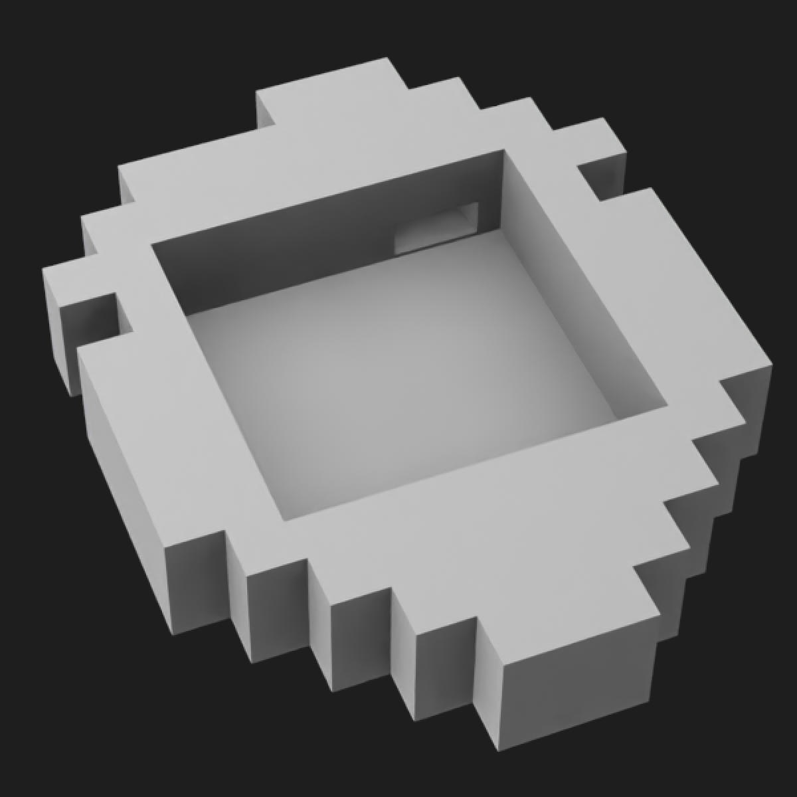
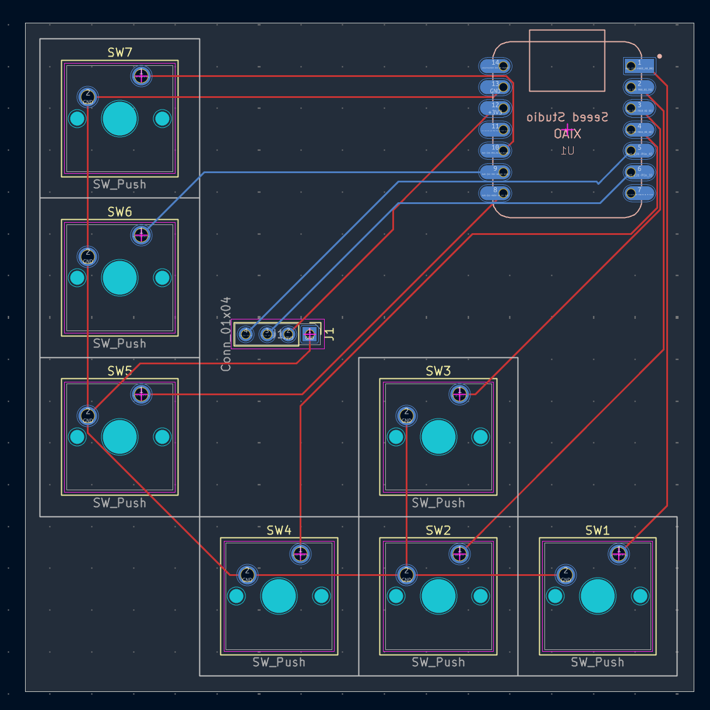
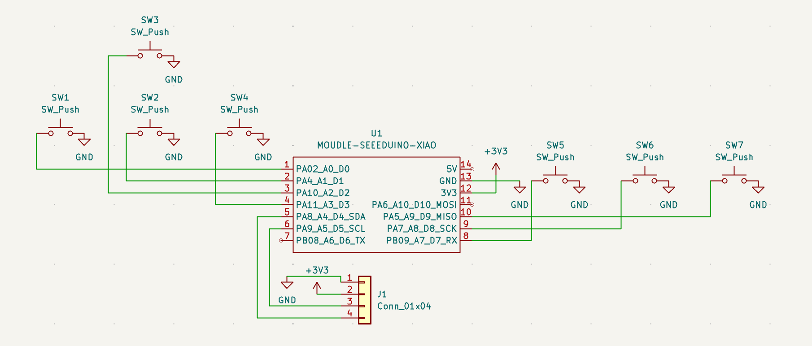

# 🍓 strawberry

my own little hackpad to play Celeste!

## Demo?

I'll try getting a demo out after receiving and building the keyboard :D

## Preview:

strawberry 3d case:


cool PCB!


and the schematic of the PCB


## Folder organisation

Trying to not being messy, here's how it is! (no this is not AI made!)

```
|- assets    # ignore, it's just github assets lol
|- case      # 3d models for the case
|- firmware  # firmware for the keyboard
|- PCB       # KiCad PCB and schematics
```